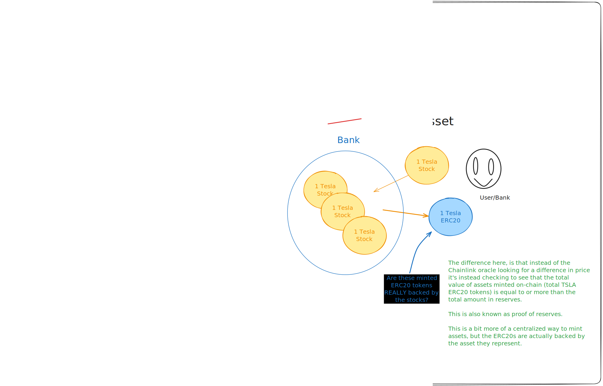

> **IMPORTANT:** *This repo is a work in progress, and contracts have not been audited. Use at your own risk.*

<br/>
<p align="center">

</p>
<br/>


# RWAs

# Table of Contents

- [RWAs](#rwas)
- [Table of Contents](#table-of-contents)
- [The Methodology](#the-methodology)
    - [Examples don't make sense](#examples-dont-make-sense)
    - [Examples that would make sense](#examples-that-would-make-sense)
- [The three examples in this repo](#the-three-examples-in-this-repo)
  - [dTSLA.sol](#dtslasol)
    - [V1](#v1)
    - [V2 (not implemented)](#v2-not-implemented)
  - [sTSLA.sol](#stslasol)
  - [BridgedWETH.sol](#bridgedwethsol)
- [Getting Started](#getting-started)
  - [Requirements](#requirements)
  - [Installation](#installation)
- [Details on the Four Examples](#details-on-the-four-examples)
  - [Fully-reserved On-Chain Asset Representation with On-Chain Collateral: frCross-Chain WETH](#fully-reserved-on-chain-asset-representation-with-on-chain-collateral-frcross-chain-weth)
  - [Synthetic On-Chain Asset Representation with On-Chain Collateral: sCross-Chain WETH](#synthetic-on-chain-asset-representation-with-on-chain-collateral-scross-chain-weth)
  - [Synthetic Off-Chain Asset Representation with On-Chain Collateral: sMSFT](#synthetic-off-chain-asset-representation-with-on-chain-collateral-smsft)
  - [Fully-reserved Off-Chain Asset Representation with Off-Chain Collateral: frMSFT](#fully-reserved-off-chain-asset-representation-with-off-chain-collateral-frmsft)
- [Currently Live Examples of Tokenized RWAs](#currently-live-examples-of-tokenized-rwas)
- [What does this unlock?](#what-does-this-unlock)
- [Disclaimer](#disclaimer)
  - [Example deployments](#example-deployments)


# The Methodology

We can tokenize real world assets by combining any of the following traits:
- Asset location: 
  - On or Off Chain Asset Represented 
  - Nomenclature: [`AOn`, `AOff`] 
    - Note: By using an on-chain asset, it could be considered no longer "real world".
- Collateral location: 
  - On or Off-Chain Collateral 
  - Nomenclature: [`COn`, `COff`] 
- Backing type:
  - Direct backing or Indirect (synthetic)
  - Nomenclature: [`DB`, `SB`]

So since we have 3 categories each with 2 options, we have 8 different types of RWAs.

<details>
<summary>Examples of the 8 assets</summary>

- Onchain asset, onchain collateral, direct backing 
  - `AOnCOnDB`
  - Examples: WETH
  - Not demo'd in this repo
- Onchain asset, onchain collateral, indirect backing (synthetic)
  - `AOnCOnSB`
  - Examples: WBTC 
  - Not demo'd in this repo
- Onchain asset, offchain collateral, direct backing 
  - `AOnCOffDB`
  - Examples: N/A
  - Maybe like a wrapped BTC ETF?
  - Not demo'd in this repo
- Onchain asset, offchain collateral, indirect backing (synthetic)
  - `AOnCOffSB`
  - Examples: N/A
  - Maybe like a wrapped BTC ETF that represents an ETH ETF?
  - Not demo'd in this repo
- Offchain asset, onchain collateral, direct backing 
  - `AOffCOnDB`
  - Examples: N/A 
  - Like a stablecoin backed by other stablecoins (sort of DAI lmao)
  - Not demo'd in this repo
- Offchain asset, onchain collateral, indirect backing (synthetic)
  - `AOffCOnSB`
  - Examples: DAI
  - In this repo: sTSLA w/ chainlink price feeds
- Offchain asset, offchain collateral, direct backing 
  - `AOffCOffDB`
  - Examples: USDC
  - In this repo: dTSLA w/ chainlink functions
- Offchain asset, offchain collateral, indirect backing (synthetic)
  - `AOffCOffSB`
  - Examples: USDT
  - In this repo: sTSLA w/ chainlink functions
  
### Examples don't make sense
- Directly Backed On-Chain Asset Representation with Off-Chain Collateral
  - We would represent ETH on Chain by collateralizing it with some off-chain version of ETH? Like an ETH ETF? Weird...
- Synthetic On-Chain Asset Representation with Off-Chain Collateral
  - The same issue as above, but even weirder since we'd back our on-chain asset with something like MSFT shares
- Directly Backed Off-Chain Asset Representation with On-Chain Collateral 
  - How could you directly back an off-chain asset with on-chain collateral? By doing that you essentially make it "synthetic" automatically

### Examples that would make sense 
- Synthetic Off-Chain Asset Representation with Off-Chain Collateral
  - This would be like a synthetic index fund share, but backed by shares of different stocks.
</details>


<br/>
<p align="center">

</p>
<br/>

# The three examples in this repo

In this repo, we will go over how to tokenize a real world asset. 

1. Cross-Chain WETH with On-Chain collateral, Directly Backed: `AOnCOnDB` - `CrossChainWETH.sol` 
2. TSLA Share with On-Chain collateral, Synthetic: `AOffCOnSB` - `sTSLA.sol` ✅ 
3. TSLA Share with Off-Chain collateral, Directly Backed: `AOffCOffDB` - `dTSLA.sol` ✅ 

The idea here, is that once you see the power of how to do our fourth example, you should be able to *tokenize any real world assets* in the world. 

The reason we have 4 examples, is that each step from 1 -> 4, we learn a little more about how to tokenize an asset, and the different strategies we can use. 

## dTSLA.sol

### V1
1. Only the owner can mint `dTSLA`
2. Anyone can redeem `dTSLA` for `USDC` or "the stablecoin" of choice.
  - Chainlink functions will kick off a `TSLA` sell for USDC, and then send it to the contract
3. The user will have to then call `finishRedeem` to get their `USDC`.

### V2 (not implemented)
1. Users can send USDC -> `dTSLA.sol` via `sendMintRequest` via Chainlink Functions. This will kick off the following:
  - USDC will be sent to Alpaca
  - USDC will be sold for USD 
  - USD will be used to buy TSLA shares
  - The Chainlink Functions will then callback to `_mintFulFillRequest`, to enable `dTSLA` tokens to the user.
2. The user can then call `finishMint` to withdraw their minted `dTSLA` tokens. 

## sTSLA.sol

This is essentially a synthetic TSLA token, it's follows a similar architecture to a stablecoin, where we use a Chainlink price feed to govern the price of the token.

You can learn more about how to build these by following the [Cyfrin Updraft](https://updraft.cyfrin.io/) curriculum. 

## BridgedWETH.sol

So, token transfers are baked into the CCIP protocol, but you have to work with the DONs to get these setup. We will show you how to create your own token pools with CCIP and not bother working with the DONs, since CCIP allows you to send arbitrary data to the other chain.

1. WETH contract on "home" chain 
2. BridgedWETH contract on all other chains 
3. Chainlink CCIP Sender & Receiver Contract 
  - Lock the WETH 
  - Emit the message to unlock on the other chain 
  - Mint the WETH 
  - Will need to burn the WETH and send it back 

# Getting Started 

## Requirements

- [git](https://git-scm.com/book/en/v2/Getting-Started-Installing-Git)
  - You'll know you did it right if you can run `git --version` and you see a response like `git version x.x.x`
- [foundry](https://getfoundry.sh/)
  - You'll know you did it right if you can run `forge --version` and you see a response like `forge 0.2.0 (816e00b 2023-03-16T00:05:26.396218Z)`
- [node](https://nodejs.org/en/download/)
  - You'll know you did it right if you can run `node --version` and you see a response like `v16.13.0`  
- [npm](https://www.npmjs.com/get-npm)
  - You'll know you did it right if you can run `npm --version` and you see a response like `8.1.0`
- [deno](https://docs.deno.com/runtime/manual/getting_started/installation)
  - You'll know you did it right if you can run `deno --version` and you see a response like `deno 1.40.5 (release, x86_64-apple-darwin) v8 12.1.285.27 typescript 5.3.3`

## Installation

1. Clone the repo, navigate to the directory, and install dependencies with `make`
```
git clone https://github.com/PatrickAlphaC/rwa-creator
cd rwa-creator
make
```

# Details on the Four Examples 
## Fully-reserved On-Chain Asset Representation with On-Chain Collateral: frCross-Chain WETH 
   1. Collateral: On-Chain ETH 
      1. Since the collateral is the same, this is a fully-reserved/backed asset! 
   2. Stability Mechanism: Algorithmic 
   3. Using: Chainlink CCIP 
      1. Would be improved by a Chainlink Proof of Reserve (PoR) 

Technically, even the "normal" [WETH token](https://etherscan.io/token/0xc02aaa39b223fe8d0a0e5c4f27ead9083c756cc2) could be considered a fully-reserved on-chain collateralized asset! 

## Synthetic On-Chain Asset Representation with On-Chain Collateral: sCross-Chain WETH 
   1. Collateral: Random ERC20s 
      1. Since the collateral is different, this is a synthetic asset! 
   2. Stability Mechanism: Algorithmic 
   3. Using: Chainlink Price Feeds, Chainlink CCIP 
      1. Would be improved by a Chainlink Proof of Reserve (PoR) 
   
## Synthetic Off-Chain Asset Representation with On-Chain Collateral: sMSFT 
   1. Collateral: On-Chain ETH 
      1. Since the collateral is different, this is a synthetic asset! 
   2. Stability Mechanism: Algorithmic 
      1. We can have an algorithmic stability mechanism because we are using on-chain collateral 
   3. Using: Chainlink Price Feeds 

## Fully-reserved Off-Chain Asset Representation with Off-Chain Collateral: frMSFT 
   1. Collateral: Off-Chain MSFT shares 
      1. Makes it fully-reserved! 
   2. Stability Mechanism: Governed / Centralized 
      1. It's borderline impossible to make this algorithmic at the moment 
      2. There is too much trust needed in custodian holding the MSFT shares! 
   3. Using: Chainlink Functions 
      1. Would be improved by a Chainlink Proof of Reserve (PoR) 

  

# Currently Live Examples of Tokenized RWAs
Some good examples of these are:
1. Fully-reserved On-Chain Asset Representation with On-Chain Collateral: [Wrapped BTC](https://www.bitgo.com/newsroom/press-releases/bitgo-adopts-chainlink-enable-on-chain-auditing-for-wbtc/)
   1. This uses a Chainlink PoR (proof of reserve) network to track the amount of BTC in a wallet on the BTC network. 
   2. Only if that wallet has enough BTC (checked by CL) can they then mint WBTC on the ETH network
2. Synthetic On-Chain Asset Representation with On-Chain Collateral: [RAI](https://reflexer.finance/)
   1. RAI token is a "synthetic dollar" that is backed by ETH.
   2. Most stablecoins fall into either being backed or synthetic dollars. 
3. Fully-reserved Off-Chain Asset Representation with Off-Chain Collateral: [USDC](https://www.circle.com/en/usdc)
   1. Each USDC is backed 1:1 by a dollar equivalent in a bank account.
   2. It could be improved by a Chainlink PoR, pushing it away from the centralization that comes with it being governed.
4. Synthetic Off-Chain Asset Representation with Off-Chain Collateral: [USDT](https://tether.to/)
   1. Each USDT is backed by a basket of assets that equal the value of a dollar.
   2. This would be improved by a Chainlink PoR

# What does this unlock?

Being able to tokenize real world assets unlocks *a whole new world of DeFi*. Happy building. 

You can use Chainlink Functions to get the pricing information of *any asset class.*

You can use Chainlink Functions to read from your off-chain custodian untill you have a more professional Chainlink PoR solution. 

# Disclaimer 

None of the code has been audited or undergone a security review, use at your own risk. Using Chainlink Functions to read data from is very easy to get wrong if you're doing it wrong in a production system. If you do create a product with this knowledge, please [reach out for a security review/audit.](https://www.cyfrin.io/)

Also in this repo:
- Generalized CCIP setup for the 3 types we demo in this repo. CrossChain functionality will be crucial for RWAs to be useful. 

## Example deployments
